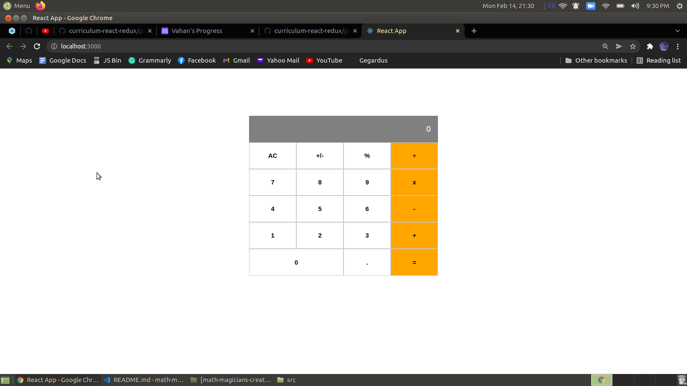

# Math Magicians

> "Math magicians" is a website for all fans of mathematics. It is a Single Page App (SPA) that allows users to make simple calculations. In this fourth part of the project, the Calculator component developed in previous projects has been redesigned. Instead of using class-based components, hooks are now used.

## Built With

- React

## Live Demo

[Heroku](https://stormy-ravine-17559.herokuapp.com/)

[Netlify](https://621b7e84632f900007382f4c--inspiring-banach-df4707.netlify.app/)

## Getting Started

To get a local copy up and running follow these simple example steps:

### Prerequisites

- clone repo: `https://github.com/Gegardus/math-magicians.git`

- then `cd math-magicians`

### Install

- run `npm install` to install dependencies

- run `npm start` to enable webpack live server

### Run tests

Run `npm run test` to launch the test runner in the interactive watch mode.   See the section [running tests](https://create-react-app.dev/docs/running-tests/) for more information.

## Contribute

Contributions, issues, and feature requests are welcome!

Feel free to check the [issues page](https://github.com/Gegardus/math-magicians/issues)

## Author

👤 **Vahan Khachvankian**

- GitHub: [@githubhandle](https://github.com/Gegardus)
- Twitter: [@twitterhandle](https://twitter.com/Gegardus)

## Author

👤 **Daniel Yerimah**

- GitHub: [@yerimah](https://github.com/yerimah)
- Twitter: [@iamdeewyne](https://twitter.com/iamdeewyne)
- LinkedIn: [@daniel-yerimah](https://www.linkedin.com/in/daniel-yerimah/)

## Acknowledgements

The authors highly appreciate the help in the project from all the participants of this week's program for the timely response to all questions.

## 📝 License

This project is [MIT](./MIT.md) licensed.
